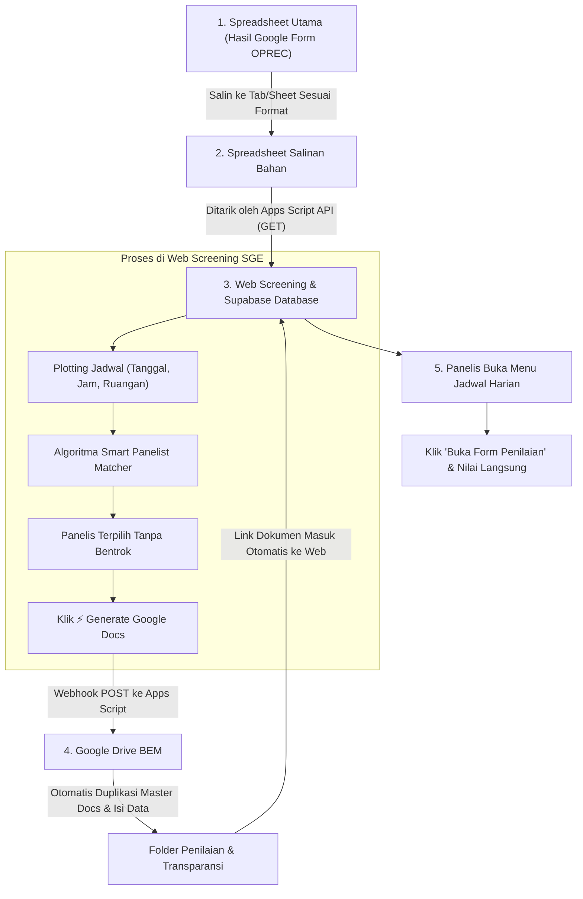

# 🚀 SGE BEM FILKOM UB 2026 — Screening & Plotting Management System

Sistem manajemen terintegrasi untuk proses seleksi dan screening **Staff SGE BEM FILKOM Universitas Brawijaya 2026**. Aplikasi ini menggabungkan sinkronisasi Google Spreadsheet, database real-time Supabase, algoritma rekomendasi panelis cerdas (*Smart Priority & Slot Conflict Prevention*), serta **Auto-Generate Google Docs** ke Google Drive resmi BEM secara otomatis.

---

## 🔗 Kumpulan Link Resmi & Direktori Sistem

Berikut adalah pusat seluruh tautan penting yang digunakan dalam sistem screening ini:

| Komponen | Nama / Deskripsi | Tautan Resmi |
| :--- | :--- | :--- |
| 🌐 **Live Web App** | Vercel Production Deployment | [https://screening-sge.vercel.app/](https://screening-sge.vercel.app/) |
| 💻 **Source Code** | GitHub Repository | [https://github.com/raraiklila/screening-sge](https://github.com/raraiklila/screening-sge) |
| 📊 **Master Data** | Spreadsheet Utama (Sumber Mentah Pendaftaran) | [Buka Spreadsheet Utama](https://docs.google.com/spreadsheets/d/1z0zV73LWkeK37Y8-U1YOhcJgJyQeVjPD/edit?usp=sharing&ouid=101675770046503523336&rtpof=true&sd=true) |
| 📋 **Bahan Olah** | Spreadsheet Salinan Bahan (Target Fetch API) | [Buka Spreadsheet Salinan Bahan](https://docs.google.com/spreadsheets/d/16Il579tuuH98t_nFdy0RiIcb4G7kUInY_C-PPrSHMhY/edit?usp=sharing) |
| ⚙️ **Apps Script 1** | Editor Script (Fetch Spreadsheet & Ketersediaan) | [Buka Script Editor 1](https://script.google.com/u/0/home/projects/1X00H5SAnF0QjfrcgyS6psu0LPvpNYOmNTIDA4BWgNHpvn5LrlOO2rhe6/edit) |
| 🚀 **Deploy API 1** | Web App URL (Fetch Data & Ketersediaan Panelis) | [Endpoint Fetch API](https://script.google.com/macros/s/AKfycbxPbigiK814NsJmCimn8ddxt-SBG3LS2B3m_OsLbTAGLnXit7JOLsdbDXQb3filH70S/exec) |
| ⚙️ **Apps Script 2** | Editor Script (Auto-Generate Google Docs) | [Buka Script Editor 2](https://script.google.com/home/projects/1HVV7Z9cINTH-GrYk2YhRY8Cfl3hjgpLMdfI4naqPKQCTEbe1mhS0OOYi/edit) |
| 🚀 **Deploy API 2** | Web App URL (Webhook Generate Google Docs) | [Endpoint GDocs Webhook](https://script.google.com/macros/s/AKfycbz0klgow5ZETkMSnvPuj3716_Nzne4TrEjvuBKHqstnW3IeGx2wWKUklzIiBwA58mcc/exec) |
| 📁 **Drive Folder 1** | Target Folder Form Penilaian Interview | [Buka Folder Form Penilaian](https://drive.google.com/drive/folders/1IFl5MndY0VxMS_cDI0UIPip0LJkYVvwf) |
| 📁 **Drive Folder 2** | Target Folder Form Transparansi Interview | [Buka Folder Form Transparansi](https://drive.google.com/drive/folders/1AOLbEPFkVCz7aBtAOt-FaiSn2Yozg85E) |
| 📄 **Master Docs 1** | Template Master Form Penilaian | [Buka Template Penilaian](https://docs.google.com/document/d/1JwU79RHBfpqyqOOYs62wT5CHEUAZzb7nc4B-y1N2zlM/edit?usp=sharing) |
| 📄 **Master Docs 2** | Template Master Form Transparansi | [Buka Template Transparansi](https://docs.google.com/document/d/1nToXP6VlGrSu3_2TT8S_B2joVKjOK6LGmbBnitZKNpQ/edit?usp=sharing) |

---

## 🔄 Alur Kerja Sistem (Operational Workflow)

Diagram alur berikut menjelaskan tahapan operasional dari data pendaftar masuk hingga sesi wawancara selesai:



---

### 📖 Panduan Langkah demi Langkah:

### Tahap 1: Memindahkan Data dari Spreadsheet Utama ke Salinan Bahan
1. Buka [Spreadsheet Utama](https://docs.google.com/spreadsheets/d/1z0zV73LWkeK37Y8-U1YOhcJgJyQeVjPD/edit?usp=sharing&ouid=101675770046503523336&rtpof=true&sd=true).
2. Salin data pendaftar baru ke [Spreadsheet Salinan Bahan](https://docs.google.com/spreadsheets/d/16Il579tuuH98t_nFdy0RiIcb4G7kUInY_C-PPrSHMhY/edit?usp=sharing) pada tab `ALL Registrants`.
3. Pastikan kolom minimal berikut terisi:
   - `Nama Lengkap`
   - `Pilihan 1` & `Pilihan 2`
   - `Link Berkas / CV`
   - `ID Line`
4. Untuk jadwal ketersediaan panelis, pastikan terisi pada tab sheet tanggal masing-masing (`01-10-2026` s.d. `10-10-2026`) atau tab jadwal kategori (`BoD`, `C-Level`, `IRE`, `Mentor`, `Staff`).

---

### Tahap 2: Sinkronisasi Data ke Web & Supabase
1. Buka Web [screening-sge.vercel.app](https://screening-sge.vercel.app/) atau buka di localhost.
2. Masuk ke menu **All Registrants** atau **Ketersediaan Panelis**.
3. Klik tombol **`Sync Spreadsheet`**:
   - Sistem akan memanggil endpoint Apps Script `VITE_APPS_SCRIPT_URL`.
   - Data otomatis diparse dan disimpan ke **Cache Lokal** dan **Database Supabase**.
   - *Tips:* Anda bisa klik tombol **`⚙️ (Settings)`** di samping tombol sync untuk melihat status koneksi atau mengganti URL endpoint jika ada pembaruan script.

---

### Tahap 3: Plotting & Pemilihan Panelis
Pada tabel **All Registrants**:
1. **Tanggal & Waktu:** Pilih tanggal dan slot jam wawancara untuk kandidat.
2. **Prioritas Dropdown Panelis Otomatis:**
   - Dropdown akan mengurutkan panelis berdasarkan kecocokan kementerian/biro dengan **Pilihan 1** & **Pilihan 2** kandidat.
   - Urutan tingkatan prioritas: **`Mentor > Staff > C-Level > IRE > BoD`**.
   - Format nama panelis ditampilkan informatif: `Nama - Tingkatan - Singkatan Divisi` (contoh: `Kak Daffa - BoD - President`, `Daffa - IRE - HC`).
3. **Anti Bentrok Slot Waktu (*Conflict Exclusion*):**
   - Jika seorang panelis sudah dipilih oleh kandidat lain pada tanggal dan jam yang sama, namanya **otomatis hilang** dari pilihan kandidat lain di slot tersebut.
   - Panelis 1 dan Panelis 2 tidak bisa memilih orang yang sama.

---

### Tahap 4: Auto-Generate Google Docs ke Google Drive BEM
1. Setelah plotting selesai, klik tombol **`⚡ Generate GDocs`** di bagian atas tabel.
2. Pilih opsi:
   - **Hanya Pendaftar Baru (Rekomendasi):** Sistem hanya membuat dokumen untuk pendaftar yang belum memiliki link Google Docs. Pendaftar yang sudah dinilai **tidak akan tertimpa/terduplikasi**.
   - **Sinkronisasi Semua:** Memeriksa dan memperbarui seluruh pendaftar.
3. Klik **Generate Dokumen**:
   - Script akan menyalin template master ke folder target Drive.
   - Placeholder teks seperti `{{NAMA}}`, `{{PILIHAN_1}}`, `{{PILIHAN_2}}`, `{{PANELIS_1}}`, `{{PANELIS_2}}` otomatis terisi.
   - Hak akses edit otomatis dibuka (*Anyone with link can edit*).
   - Link dokumen langsung terpasang di baris tabel web.

---

### Tahap 5: Pelaksanaan Wawancara oleh Panelis
1. Panelis atau staf membuka menu **Jadwal Harian** (misal: *05 Oktober 2026*).
2. Filter berdasarkan jam wawancara atau cari nama pendaftar.
3. Klik tombol **`Form Penilaian`** atau **`Transparansi`** untuk membuka dokumen Google Docs langsung dan melakukan penilaian.
4. Update **Status Interview** (`Belum` / `Selesai`) dan **Kelulusan LKMM-TD** (`Lulus` / `Tidak Lulus`).

---

## 🛡️ Arsitektur Proteksi & Ketahanan Sistem (Multi-Tier Redundancy)

Untuk mencegah downtime saat hari-H screening, sistem dirancang dengan 3 lapis perlindungan:

1. **Lapis 1: Supabase Cloud Database (Real-Time)**
   - Bertindak sebagai database operasional super cepat (*sub-second response*).
   - Perubahan plotting dan status wawancara tersimpan instan tanpa membebani kuota harian Google Apps Script.
2. **Lapis 2: Cache Lokal (`localStorage` & Bundled Data)**
   - Jika koneksi internet panitia terganggu, aplikasi tetap dapat dibuka dan menampilkan seluruh data pendaftar dari cache browser.
3. **Lapis 3: Fallback Direct Google Docs Copy**
   - Jika webhook Apps Script mengalami timeout atau limit kuota Google, sistem otomatis mengalihkan tombol ke direct copy link template resmi Google Docs (`/copy?title=...`).

---

## 🔐 Hak Akses & Kredensial

| Role | Username | Password | Hak Akses |
| :--- | :--- | :--- | :--- |
| 👑 **Admin (IRE)** | `ire hebat` | `semangatIRE` | Akses penuh edit semua kolom, batch generate GDocs, reset plotting. |
| 👥 **Staf Biasa / Panelis** | *(Tanpa Login)* | *(Tanpa Login)* | Hanya bisa edit Panelis 1 & 2, Ruangan, Status Interview, LKMM-TD, dan Lembaga Lain. Kolom jadwal dan identitas terkunci aman. |

---

## ⚙️ Konfigurasi Environment Variables (`.env`)

Buat file `.env` di direktori root proyek dengan format berikut:

```env
# Supabase Configuration
VITE_SUPABASE_URL=https://xcqfgecywhpfwjhvanse.supabase.co
VITE_SUPABASE_ANON_KEY=eyJhbGciOiJIUzI1NiIsInR5cCI6IkpXVCJ9...

# Google Apps Script Endpoints
VITE_APPS_SCRIPT_URL=https://script.google.com/macros/s/AKfycbxPbigiK814NsJmCimn8ddxt-SBG3LS2B3m_OsLbTAGLnXit7JOLsdbDXQb3filH70S/exec
VITE_GDOCS_WEBHOOK_URL=https://script.google.com/macros/s/AKfycbz0klgow5ZETkMSnvPuj3716_Nzne4TrEjvuBKHqstnW3IeGx2wWKUklzIiBwA58mcc/exec
```

---

## 💻 Menjalankan Proyek Secara Lokal

```bash
# 1. Clone repository
git clone https://github.com/raraiklila/screening-sge.git
cd screening-sge

# 2. Install dependencies
npm install

# 3. Jalankan development server
npm run dev

# 4. Build untuk production
npm run build
```

---

*Dikembangkan untuk **Badan Eksekutif Mahasiswa Fakultas Ilmu Komputer Universitas Brawijaya (BEM FILKOM UB) 2026**.*
