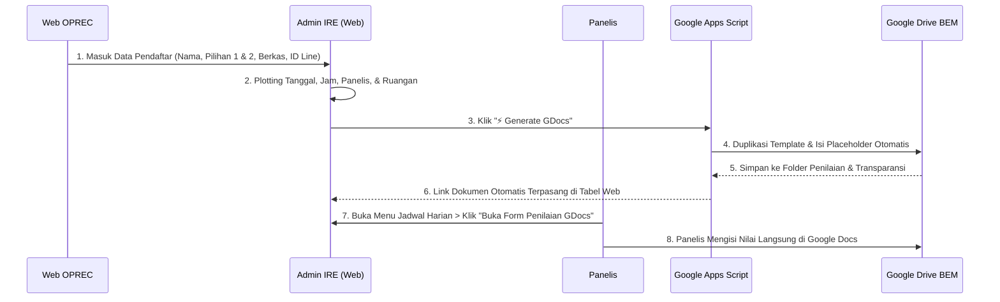

# 📚 Dokumentasi Sistem Screening & Recruitment SGE BEM FILKOM UB

Sistem terintegrasi untuk manajemen plotting jadwal screening, pencocokan ketersediaan panelis, pelacakan status pendaftar, dan **Auto-Generate Google Docs** ke Google Drive resmi BEM FILKOM UB secara real-time.

---

## 📑 Daftar Isi
1. [Spesifikasi Integrasi API Web OPREC BEM](#1-spesifikasi-integrasi-api-web-oprec-bem)
2. [Struktur & Pengaturan Google Drive](#2-struktur--pengaturan-google-drive)
3. [Panduan Template Master Google Docs & Placeholder](#3-panduan-template-master-google-docs--placeholder)
4. [Kode Google Apps Script & Panduan Deployment](#4-kode-google-apps-script--panduan-deployment)
5. [Alur Penggunaan Sistem di Web](#5-alur-penggunaan-sistem-di-web)
6. [Hak Akses & Kredensial Akun](#6-hak-akses--kredensial-akun)

---

## 1. Spesifikasi Integrasi API Web OPREC BEM

Web Screening ini dirancang untuk mengonsumsi data mentah pendaftar hasil Open Recruitment (OPREC) BEM FILKOM UB.

### A. Data yang Dibutuhkan dari API OPREC
API dari Web Oprec hanya perlu menyediakan **6 field utama**:

| Field | Tipe Data | Keterangan | Contoh |
| :--- | :--- | :--- | :--- |
| `id` | `number` | ID Unik Pendaftar | `1` |
| `nama` | `string` | Nama Lengkap Mahasiswa | `"Salman Al Faritsi"` |
| `pilihan1` | `string` | Pilihan Kementerian / Biro 1 | `"Social Equity & Enviroment"` |
| `pilihan2` | `string` | Pilihan Kementerian / Biro 2 (Opsional) | `"Inter-Agency Affairs"` / `""` |
| `berkas` | `string` | Nama File / Link Google Drive Berkas | `"Berkas_Salman.pdf"` |
| `idLine` | `string` | ID Line untuk Dihubungi Humas | `"salman_123"` |

### B. Contoh Format JSON API Response (OPREC -> Web Screening)
```json
[
  {
    "id": 1,
    "nama": "Salman Al Faritsi",
    "pilihan1": "Social Equity & Enviroment",
    "pilihan2": "",
    "berkas": "https://drive.google.com/file/d/.../view",
    "idLine": "salman_123"
  },
  {
    "id": 2,
    "nama": "Dhikalaaffaiz Marisky",
    "pilihan1": "Inter-Agency Affairs",
    "pilihan2": "Human Capital",
    "berkas": "https://drive.google.com/file/d/.../view",
    "idLine": "dhika_m"
  }
]
```

> **Catatan:** Seluruh kolom operasional seperti *Tanggal, Waktu, Panelis, Ruangan, Link Form Penilaian, Transparansi, Humas, Status Plotting, Chat, dan Status Interview* akan dikelola dan disimpan secara dinamis di dalam Web Screening.

---

## 2. Struktur & Pengaturan Google Drive

Untuk memastikan dokumen penilaian dan transparansi tersimpan rapi dan terpisah, buat struktur folder di Google Drive BEM sebagai berikut:

```text
📁 My Drive (atau Shared Drive SGE FILKOM)
 └── 📁 7. Screening / TES WEB BEM
      ├── 📄 [Master Template] Form Penilaian
      ├── 📄 [Master Template] Form Transparansi
      ├── 📁 1. FORM PENILAIAN INTERVIEW    <-- Target folder form penilaian
      └── 📁 2. FORM TRANSPARANSI INTERVIEW <-- Target folder form transparansi
```

### ID Folder yang Digunakan:
* **Folder Form Penilaian**: `1hvx57KYnx2CRxGGHX1-P2FTjSAzYmoPR`
* **Folder Form Transparansi**: `1BH9WEmXdVkBEidLPVLIfb4bpV2eH9Eph`

---

### 🔍 Cara Mendapatkan ID Folder & File dari Google Drive:

Setiap folder dan file di Google Drive memiliki kode unik (**ID**) di dalam URL browser. Berikut cara mengambilnya:

#### 1. Cara Mengambil ID Folder Google Drive:
1. Buka folder yang diinginkan di Google Drive (misal: buka folder `1. FORM PENILAIAN INTERVIEW`).
2. Perhatikan address bar browser di bagian atas:
   ```text
   https://drive.google.com/drive/folders/1hvx57KYnx2CRxGGHX1-P2FTjSAzYmoPR
                                          ^^^^^^^^^^^^^^^^^^^^^^^^^^^^^^^^^
                                          KODE INI ADALAH ID FOLDER
   ```
3. **Salin hanya deretan karakter setelah `/folders/`** tersebut.

*Atau via Klik Kanan:*
* Klik kanan pada folder > pilih **Share** > **Copy link**.
* Link yang disalin berformat `https://drive.google.com/drive/folders/ID_FOLDER?usp=sharing`. Salin bagian `ID_FOLDER`-nya saja.

---

#### 2. Cara Mengambil ID Template Google Docs:
1. Buka file Google Docs Master (misal: Master Form Penilaian).
2. Perhatikan address bar browser di bagian atas:
   ```text
   https://docs.google.com/document/d/1JwU79RHBfpqyqOOYs62wT5CHEUAZzb7nc4B-y1N2zlM/edit
                                      ^^^^^^^^^^^^^^^^^^^^^^^^^^^^^^^^^^^^^^^^^^^^
                                      KODE INI ADALAH ID TEMPLATE GDOCS
   ```
3. **Salin deretan karakter antara `/d/` dan `/edit`**.

---

### Pengaturan Izin Folder & File:
Pastikan folder dan template master memiliki izin akses:
* **General Access**: *Anyone with the link* (Siapa saja yang memiliki link) sebagai *Editor/Viewer*.
* Jika menggunakan Shared Drive BEM, pastikan akun Google Apps Script memiliki hak *Content Manager* atau *Contributor*.

---

## 3. Panduan Template Master Google Docs & Placeholder

### A. Format Dokumen
1. Pastikan dokumen master berformat **Google Docs Asli** (bukan `.docx` Microsoft Word).
2. Jika masih `.docx`, buka di Drive > klik **File** > **Save as Google Docs**.

### B. Master Template yang Terhubung:
* **Master Form Penilaian**: [1JwU79RHBfpqyqOOYs62wT5CHEUAZzb7nc4B-y1N2zlM](https://docs.google.com/document/d/1JwU79RHBfpqyqOOYs62wT5CHEUAZzb7nc4B-y1N2zlM/edit)
* **Master Form Transparansi**: [1nToXP6VlGrSu3_2TT8S_B2joVKjOK6LGmbBnitZKNpQ](https://docs.google.com/document/d/1nToXP6VlGrSu3_2TT8S_B2joVKjOK6LGmbBnitZKNpQ/edit)

### C. Daftar Kode Placeholder Teks yang Didukung:
Ketik kode berikut di dokumen template master pada posisi yang diinginkan:

| Placeholder | Keterangan | Nilai yang Otomatis Terisi |
| :--- | :--- | :--- |
| `{{NAMA}}` atau `[Nama]` atau `(Full Name)` | Nama Pendaftar | Nama lengkap dari web |
| `{{PILIHAN_1}}` | Pilihan Kementerian 1 | Pilihan 1 dari web |
| `{{PILIHAN_2}}` | Pilihan Kementerian 2 | Pilihan 2 dari web (atau `-` jika kosong) |
| `{{PANELIS_1}}` | Nama Panelis 1 | Panelis 1 yang di-plot |
| `{{PANELIS_2}}` | Nama Panelis 2 | Panelis 2 yang di-plot |

---

## 4. Kode Google Apps Script & Panduan Deployment

Google Apps Script bertindak sebagai jembatan backend antara Web Screening dan Google Drive.

### A. Kode Script Lengkap (Lengkap dengan Fitur Anti-Duplikasi)
Salin kode berikut ke proyek Google Apps Script Anda (**[script.google.com](https://script.google.com/)**):

```javascript
// ================= ID FOLDER & TEMPLATE RESMI BEM =================
// 1. ID Folder Masing-Masing
const FOLDER_PENILAIAN_ID = "1hvx57KYnx2CRxGGHX1-P2FTjSAzYmoPR";
const FOLDER_TRANSPARANSI_ID = "1BH9WEmXdVkBEidLPVLIfb4bpV2eH9Eph";

// 2. ID Template Master GDocs
const TEMPLATE_PENILAIAN_ID = "1JwU79RHBfpqyqOOYs62wT5CHEUAZzb7nc4B-y1N2zlM";
const TEMPLATE_TRANSPARANSI_ID = "1nToXP6VlGrSu3_2TT8S_B2joVKjOK6LGmbBnitZKNpQ";
// ==================================================================

function doPost(e) {
  try {
    const data = JSON.parse(e.postData.contents);
    const { type, nama, pilihan1, pilihan2, panelis1, panelis2 } = data;
    
    const isPenilaian = type === 'penilaian';
    
    // Tentukan template, folder tujuan, dan nama file
    const templateId = isPenilaian ? TEMPLATE_PENILAIAN_ID : TEMPLATE_TRANSPARANSI_ID;
    const targetFolderId = isPenilaian ? FOLDER_PENILAIAN_ID : FOLDER_TRANSPARANSI_ID;
    const fileName = (isPenilaian ? "Form Penilaian - " : "Form Transparansi - ") + (nama || "Pendaftar");
    
    const targetFolder = DriveApp.getFolderById(targetFolderId);

    // 🛡️ FITUR ANTI-DUPLIKASI: Cek apakah file sudah ada di folder
    const existingFiles = targetFolder.getFilesByName(fileName);
    if (existingFiles.hasNext()) {
      const existingFile = existingFiles.next();
      return ContentService.createTextOutput(JSON.stringify({
        success: true,
        url: existingFile.getUrl(),
        docId: existingFile.getId(),
        isExisting: true
      })).setMimeType(ContentService.MimeType.JSON);
    }
    
    // 1. Buat salinan baru dari template ke folder tujuan
    const templateFile = DriveApp.getFileById(templateId);
    const newDocFile = templateFile.makeCopy(fileName, targetFolder);
    const newDocId = newDocFile.getId();
    
    // 2. Buka Dokumen dan Ganti Placeholder dengan Data Pendaftar
    const doc = DocumentApp.openById(newDocId);
    const body = doc.getBody();
    
    body.replaceText("{{NAMA}}", nama || "-");
    body.replaceText("{{PILIHAN_1}}", pilihan1 || "-");
    body.replaceText("{{PILIHAN_2}}", pilihan2 || "-");
    body.replaceText("{{PANELIS_1}}", panelis1 || "-");
    body.replaceText("{{PANELIS_2}}", panelis2 || "-");
    
    // Support format kurung siku / kurung biasa
    body.replaceText("\\[Nama\\]", nama || "-");
    body.replaceText("\\[nama\\]", nama || "-");
    body.replaceText("\\(Full Name\\)", nama || "-");
    
    doc.saveAndClose();
    
    // 3. Beri izin akses edit agar panelis bisa mengisi
    newDocFile.setSharing(DriveApp.Access.ANYONE_WITH_LINK, DriveApp.Permission.EDIT);
    
    return ContentService.createTextOutput(JSON.stringify({
      success: true,
      url: newDocFile.getUrl(),
      docId: newDocId
    })).setMimeType(ContentService.MimeType.JSON);
    
  } catch (err) {
    return ContentService.createTextOutput(JSON.stringify({
      success: false,
      error: err.toString()
    })).setMimeType(ContentService.MimeType.JSON);
  }
}
```

### B. Langkah Deployment Web App:
1. Buka **[script.google.com](https://script.google.com/)** > Buat Proyek Baru / Buka Proyek Anda.
2. Paste kode di atas > Klik **Save (💾)**.
3. Klik tombol biru **Deploy** > **New deployment**.
4. Klik ikon gear ⚙️ > Pilih **Web app**.
   * **Description**: `SGE FILKOM Screening API v1`
   * **Execute as**: `Me (email akun BEM)`
   * **Who has access**: `Anyone` *(Penting agar web frontend dapat mengirim request)*.
5. Klik **Deploy** > Berikan izin akses (*Authorize Access*).
6. Salin **Web app URL** yang dihasilkan:
   ```text
   https://script.google.com/macros/s/AKfycbzXqfDb0V_ULpOp9bWv8m6CJtAYwK41DBFDosBlYd1JVkl2uNvAwtGsfJu2leXrFIPZ/exec
   ```

---

## 5. Alur Penggunaan Sistem di Web



### Fitur Unggulan Web:
* **Smart Auto-Skip**: Saat ada pendaftar baru masuk, sistem hanya akan membuatkan dokumen untuk pendaftar baru tersebut. Pendaftar lama yang nilainya sudah diisi panelis **tidak akan tertimpa/terhapus**.
* **Quick Single Generate**: Tombol 🔄 di setiap baris tabel untuk membuat ulang dokumen pendaftar tertentu secara individual.
* **Auto-Routing Navbar Jadwal Harian**: Jadwal interview harian otomatis muncul di navbar samping setelah pendaftar di-plot (`Status Plotting: Sudah`) dan terkonfirmasi hadir (`Bisa Interview: Ya`).

---

## 6. Hak Akses & Kredensial Akun

Untuk menjaga integritas dan keamanan data plotting, sistem menggunakan 2 tingkatan hak akses:

### 👑 1. Admin (IRE) - Akses Penuh
* **Kredensial**:
  * **Username**: `ire hebat`
  * **Password**: `semangatIRE`
* **Hak Akses**: Dapat mengedit seluruh kolom (Tanggal, Jam, Status Plotting, Humas, Chat, Kehadiran, Panelis, Ruangan, LKMM, Status Interview, Lembaga Lain, serta Batch Generate GDocs).

### 👥 2. Staf Biasa / Panelis (Default Public)
* **Kredensial**: Tidak memerlukan login.
* **Hak Akses Terbatas**: Hanya dapat mengedit:
  1. **Panelis 1 & Panelis 2**
  2. **Ruangan**
  3. **Kelulusan LKMM-TD**
  4. **Status Interview**
  5. **Daftar Lembaga Lain**
  *(Kolom krusial plotting lainnya dikunci secara aman dalam mode Read-Only)*.

---

## 🛠️ Tech Stack & Menjalankan Proyek Lokal

* **Framework**: React 19 + TypeScript + Vite
* **Styling**: Tailwind CSS v4 + Vanilla Design System BEM FILKOM UB
* **Icons**: Lucide React
* **Typography**: Plus Jakarta Sans

### Menjalankan di Lokal:
```bash
# Install dependencies
npm install

# Jalankan dev server
npm run dev

# Build production
npm run build
```

---
*Dibuat dengan ❤️ untuk Badan Eksekutif Mahasiswa Fakultas Ilmu Komputer Universitas Brawijaya (BEM FILKOM UB) 2026.*
